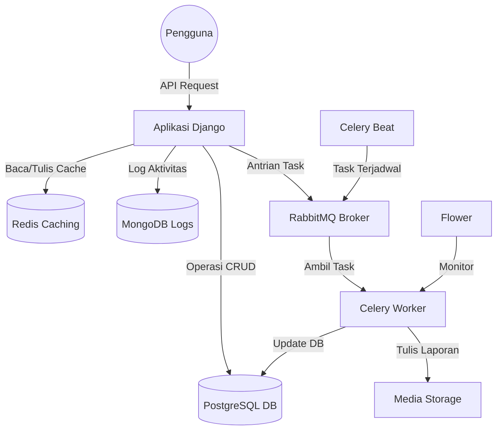

# Dokumentasi: Integrasi Simple LMS

## Diagram Arsitektur

## Strategi Caching
- **Pola**: Cache Aside (Lazy Loading).
- **Target**: Daftar Kursus (Course List) dan Detail Kursus (Course Detail).
- **TTL (Time To Live)**: 15 Menit.
- **Invalidasi Cache**: 
  - Dipicu melalui Django Signals (`post_save`, `post_delete` pada model `Course`).
  - Menggunakan `cache.delete_pattern` untuk daftar kursus dan `cache.delete` untuk detail kursus spesifik.

## Alur Task (Task Flow)
1. **Email Pendaftaran (Enrollment Email)**:
   - Pemicu: `POST /enrollments/`
   - Task: `send_enrollment_email` (Async)
2. **Pembuatan Sertifikat (Certificate Generation)**:
   - Pemicu: `POST /enrollments/{id}/progress` (saat semua konten selesai)
   - Task: `generate_certificate` (Async)
3. **Statistik Kursus**:
   - Pemicu: Terjadwal setiap jam melalui Celery Beat.
   - Task: `update_course_statistics`
4. **Ekspor Laporan**:
   - Pemicu: `POST /reports/export-course/{id}`
   - Task: `export_course_report` (Async)

## Pembatasan Akses (Rate Limiting)
- **Batas**: 60 permintaan per menit per pengguna/IP.
- **Implementasi**: Decorator kustom menggunakan Redis sebagai backend.
- **Kode Status**: `429 Too Many Requests`.

## Perintah Redis CLI
- **Cek semua key**: `KEYS *`
- **Cek TTL dari sebuah key**: `TTL <key>`
- **Hapus sebuah key**: `DEL <key>`
- **Hapus semua cache**: `FLUSHALL`
- **Monitor aktivitas**: `MONITOR`

## Koleksi MongoDB
- **activity_logs**: Melacak login pengguna dan pendaftaran kursus.
- **learning_analytics**: Melacak progres kursus dan jumlah pendaftaran.
